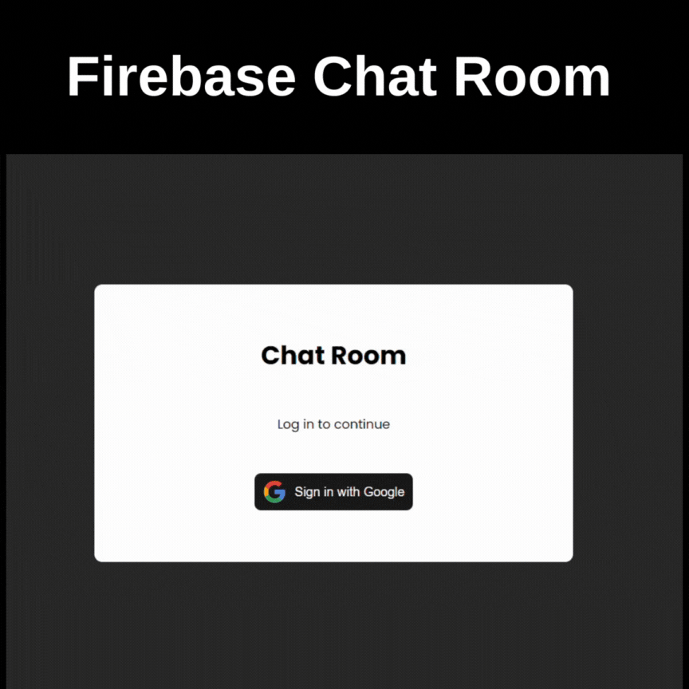

## Chat Room Application

This is a simple chat room application built with Vite, React, Firebase, and SASS. Users can sign in using their Google accounts, select chat rooms, and participate in conversations. The application leverages Firebase for authentication, data storage, and real-time chat updates.

### Features

- Google Authentication: Users can sign in using their Google accounts, ensuring secure and quick access to the chat rooms.
- Chat Rooms: Users can select from various chat rooms and join ongoing conversations.
- Real-Time Communication: Messages are updated in real-time using Firebase, providing a smooth chat experience.
- Modern UI: The application is styled with SASS for a modern and responsive user interface.

### Technologies Used

- Vite: A fast build tool and development server.
- React: A JavaScript library for building user interfaces.
- Firebase: Used for authentication, real-time database, and hosting.
- SASS: CSS pre-processor used for styling the application.
- React-DOM: A package for working with the DOM in React applications.

### GIF

